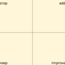

Retrospective
=============

- **Goal:** review the work/sprint since the last retrospective
- **Timeframe:** monthly for 1 hour (at least)
- **Attendees:** team

Proceed as follows, and keep the time constraints
(here 60min, but you can increase, e.g., for the first meeting).

1. Preparation: Create a board. Get some post-its.
   Or for online meetings: [miro](https://miro.com/) and [reetro.io](https://reetro.io/).

   

1. *10min* Everybody should take some post-its and write down (short, in some words):
   - What was good? What should we keep?
   - What was bad?
   - What needs to be improved?
   - What should be dropped?

1. *10-20min* Put all post-its onto the board.
   The owner/creator of a post-it should explain
   it if necessary.

   

1. *<5min* Every member takes a look at the board
   and identifies the 3 most important issues for him/herself.

1. *<5min* Every member awards 1, 2, or 3 points to 3 different issues of choice.
   The most important issue for the member will get 3 points, and so on...

   

1. *20min* Select the 3 issues with the most points collected.
   Define action points
   -- how to solve this issues for the next sprint/period?
   -- who should execute the action?

   

   Note, that the action points should be executed until the next retrospective.

1. Make a photo of the result (meeting documentation).
   Actions to be checked in the next retrospective.

References
----------

- [What is a Sprint Retrospective?][1]
- [DAKI - drop, add, keep, improve][2]
- [The 5 Best Free Online Retrospective Tools for Your Team][3]

[1]: https://www.scrum.org/resources/what-is-a-sprint-retrospective
[2]: http://www.funretrospectives.com/daki-drop-add-keep-improve/
[3]: https://medium.com/getproductpeople/the-5-best-free-online-retrospective-tools-for-your-team-5cbb0b47f9c9
